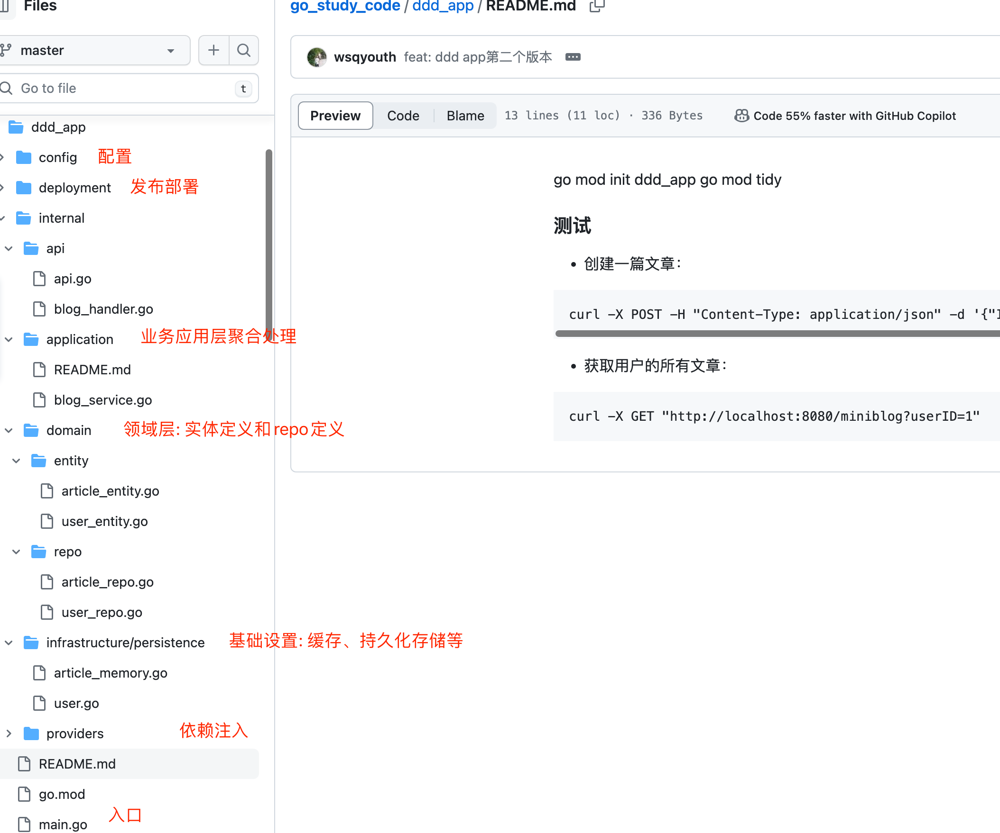

go mod init ddd_app
go mod tidy


### 测试
* 创建一篇文章：
```
curl -X POST -H "Content-Type: application/json" -d '{"ID": 1, "UserID": 1, "Title": "My Article", "Content": "This is my article."}' http://localhost:8080/miniblog
```
* 获取用户的所有文章：
```
curl -X GET "http://localhost:8080/miniblog?userID=1"
```

### 架构
